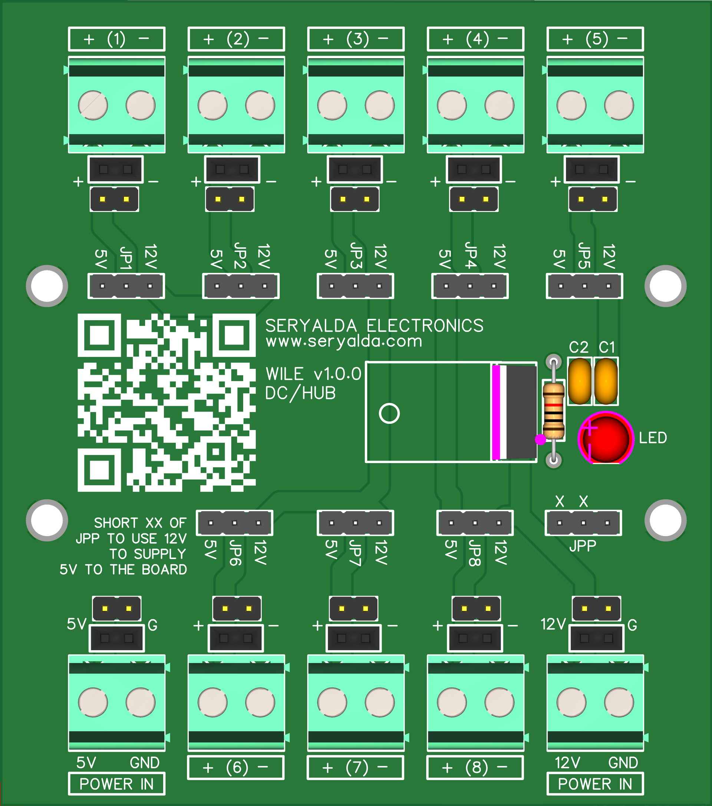
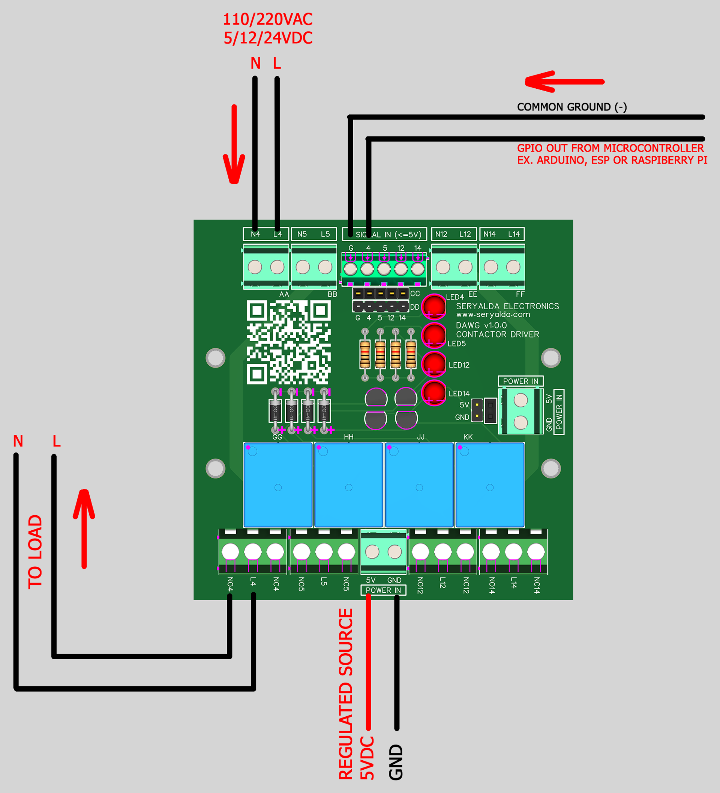
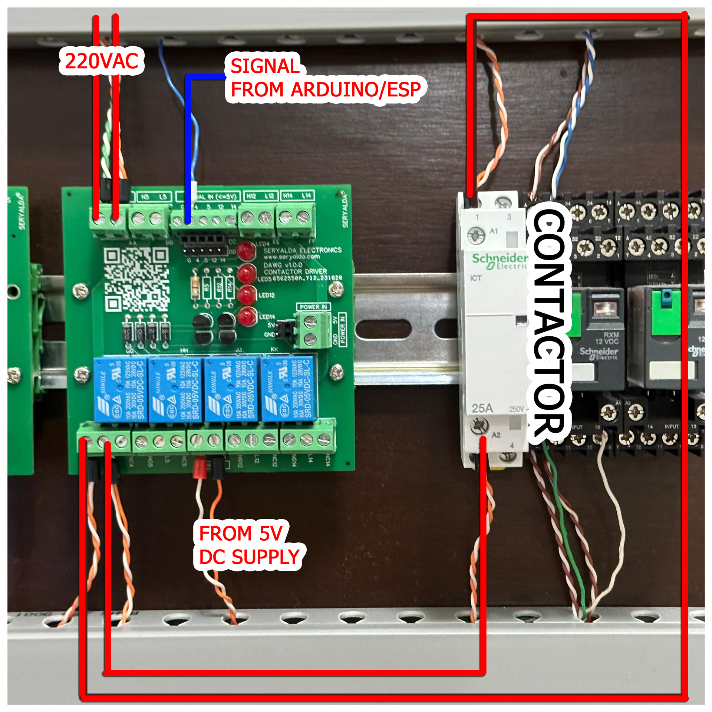
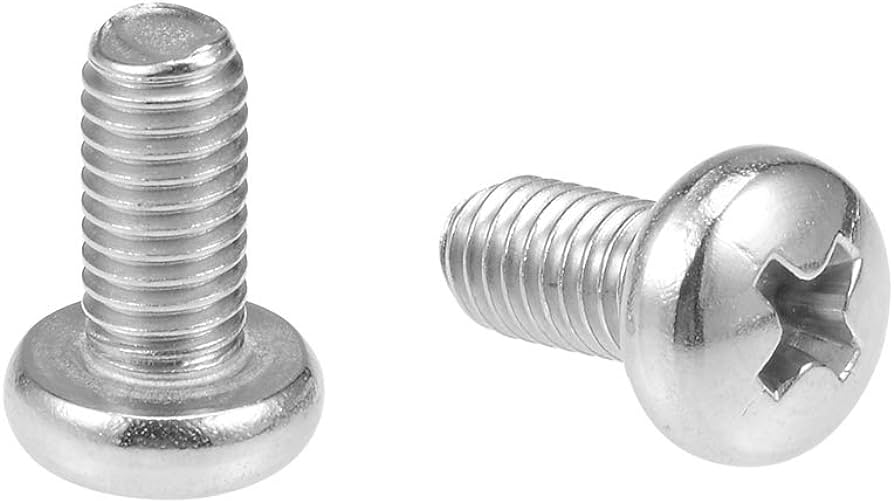
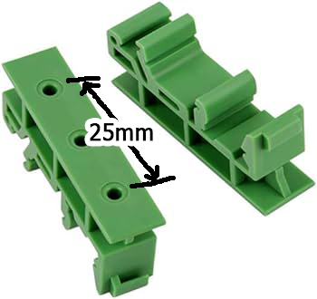

## Top
# 🎉 DAWG AC Relay Driver Board v1.0.0
### ◀️ [Back](/)

<!--📷-->

## Table of Contents

- 📚 [Overview](#overview)
- 🎯 [Features](#features)
- 🛠️ [Things you need to know](#things-you-need-to-know)
- ⚙️ [Installation](#installation)
- 🖥️ [Compatible Processor Boards](#compatible-processor-boards)
- 🤝 [FAQ](#faq)
- 🤝 [Disclaimer](#disclaimer)
- 📝 [License](#license)

## Overview

DAWG (AC Relay Driver Board). This board is purpose-built to address a common need in electronics projects: providing a reliable AC relay driver. Its primary goal is to enable low-voltage output controllers like Arduino and ESP microcontrollers to efficiently control multiple AC CONTACTORS or Industrial DC Relay Switches (of DC voltage more than 12VDC).

## Features

- **Relay Control:** This feature simplifies the process of controlling mechanical and solid-state relays, enabling you to manage higher voltage loads with ease.

- **Versatility:** The board is designed to drive HV relay switches, encompassing both mechanical and solid-state options, making it adaptable to a wide range of applications.

- **Ease of Integration:** The board ensures easy integration through user-friendly terminal screw blocks, connectors, and pin headers configurations.

- **DIN Rail Support:** DIN RAIL compatibility enables seamless mounting in standard 35mm DIN RAIL enclosures. This feature ensures that your projects have a professional and sturdy appearance and can be effortlessly integrated into existing distribution panels.

- **Comprehensive Documentation:** Access comprehensive documentation to swiftly get started and leverage the full potential of your relay driver.

[🔝 Top](#top)

## Things you need to know

NA

[🔝 Top](#top)

## Installation

Things and diagram you will need, for wiring and to implement RAIL DIN configurations:

| How to Wire Diagram | Sample Wiring | Slotted Metal Rail DIN  | Screws M3 D=3mm, L=6mm   | Mounting Brackets (25mm center to center) |
|--------------------|--------------------------------------------|-------------------------------------------------------------------------------------------------------|--------------------------------------------------------------------------------------------------------------------------------------------------|---------------|
|  |  |  |  |  |
|||[🛍️ BUYHERE](#)|[🛍️ BUYHERE](#)|[🛍️ BUYHERE](#)|

  
[🔝 Top](#top)

## Compatible Processor Boards

DAWG Board v1.0.0 also works with below Processor Board:

| Board              | Link                                       | Image                                                                                                 | Description                                                                                                                                      | GPIO Output Pins     |
|--------------------|--------------------------------------------|-------------------------------------------------------------------------------------------------------|--------------------------------------------------------------------------------------------------------------------------------------------------|---------------|
| **Foghorn v1.0.0** | [FOGHORN](https://github.com/seryalda/foghorn) |  | The board integrates with the Foghorn Version 1.0.0 Processor Board. It's an ESP8266 NodeMCU v3 compatible board with a screw terminal block output mapped to GPIO pins 4, 5, 12, and 14, allowing control of up to 4 external switch relays or CONTACTORS. | 4, 5, 12, 14 |

Explore the compatibility of DAWG with these processor boards to enhance your projects.

[🔝 Top](#top)

## FAQ

N/A

[🔝 Top](#top)

## Disclaimer

NA

[🔝 Top](#top)

## License

NA

[🔝 Top](#top)

<!--

i am creating an amazon listing for below special purpose printed circuit board, this board primary purpose is to 
act as a mounting board for ESP8266 nodeMCU V3,  

create an amazon listing descriptions in HTML format with complete cool emoji, should be easy to read and use simple terms 

and create also a bulleted features

extract this from below summary

the format is 

TITLE
DESCRIPTIONS 
FEATURES

FOGHORN BOARD
MOUNTING dual 15 pins female headers FOR ESP8266 NODEMCU V3
15 pins male and female mapped to ESP module pins for ease of use using jumper wires connections to projects
analog pin header for A0 
5 pins terminal screw block mapped directly to ground, gpio 4,5,12 and 14 microcontroller
dc supply options choose between 5vdc directly to VIN or 12vdc power source and use built in 
dc regulator to convert 12vdc to produce 5vdc and send to VIN, to use this option you need to short the XX jumper pins of JP1
there are also two pin male/female headers for allowing user to connect using jumper wires, 

the board layout  76 mm width by 86 mm high is designed to be RAIL DIN compatible, with screw hole on the sides of 25mm center to center spacing 

DHT header ready, you can insert DHT11 or DHT22 in the 5 pins female headers, 

all headers pins are 1.24mm standard spacing

-->
