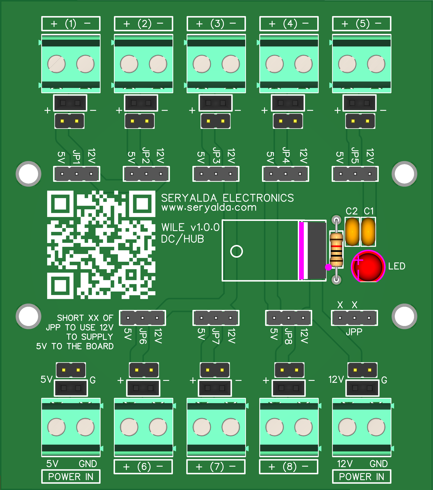

# 🚀 DAWG v1.0.0

<!--📷-->

[🏡 Back](/)
## Table of Contents

- 📚 [Introduction](#introduction)
- 🎯 [Features](#features)
- 🛠️ [Usage](#usage)
- ⚙️ [Installation](#installation)
- 📹 [Tutorials](#tutorials)
- 🖥️ [Compatible Processor Boards](#compatible-processor-boards)
- 🤝 [Contributing](#contributing)
- 📝 [License](#license)
  
[🏡 Back](/)

## Introduction

Welcome to the MARVIN PCB Board v1.0.0 showcase. This board is purpose-built to address a common need in electronics projects: providing a reliable relay driver. Its primary goal is to enable low-voltage output controllers like Arduino and ESP microcontrollers to efficiently control higher voltage switch relays.

### Key Objectives:

- **Relay Control:** MARVIN v1.0.0 simplifies the process of controlling mechanical and solid-state relays, allowing you to manage higher voltage loads with ease.

- **Versatility:** The board is designed to support both 5VDC and 12VDC relay configurations, making it adaptable to a wide range of applications.

- **Ease of Integration:** With user-friendly jumper pin configurations and DIN RAIL compatibility, MARVIN ensures easy integration into your projects and existing distribution systems.

🛒 **[Visit our E-commerce Store (Lazada)](https://www.lazada.com.ph/seryalda)** to purchase MARVIN.  (Ctrl+Click to open in a new tab)

🛒 **[Visit our E-commerce Store (Amazon.sa)](https://www.amazon.sa/s?k=seryalda)** to purchase MARVIN.  (Ctrl+Click to open in a new tab)

🎥 **[Check out our YouTube Channel](https://www.youtube.com/@seryalda)** for tutorials and project demonstrations.  (Ctrl+Click to open in a new tab)

[🔝 Back to Table of Contents](#table-of-contents)

## Features

🔌 **Versatile Relay Switch Driver:** MARVIN v1.0.0 is a versatile relay switch driver designed to control both 5VDC and 12VDC mechanical and solid-state relays.

🧩 **Jumper Pin Configuration:** The board features jumper pins that allow you to easily configure the voltage output. By shorting specific two pins, you can select either 5VDC or 12VDC to be output on the terminal.

⚙️ **Flexible Relay Control:** MARVIN provides flexible control options for various applications, making it suitable for a wide range of projects.

🔘 **Easy Integration:** The board is designed for easy integration into your projects, with clear and straightforward pin configurations.

🚀 **DIN RAIL Compatible:** MARVIN PCB Board v1.0.0 is DIN RAIL compatible, allowing you to seamlessly mount it in standard DIN RAIL enclosures. This feature ensures that your projects look professional and can be easily integrated into existing distribution panels.

📦 **Complete Package:** MARVIN PCB Board v1.0.0 comes with all the necessary components and connectors to get you started on your relay control projects.

📊 **Reliable Performance:** Built with quality components and tested for reliable performance, MARVIN ensures smooth and stable relay switching.

🖥️ **Compatible Processor Boards:** MARVIN PCB Board v1.0.0 is compatible with a range of processor boards, including the Foghorn Version 1.0.0 Processor Board, offering versatile relay control capabilities.

**Number of Relay Outputs Supported:** MARVIN PCB Board v1.0.0 supports up to 4 relay outputs, making it ideal for various applications.

📖 **Comprehensive Documentation:** Access comprehensive documentation to help you quickly get started and make the most of your relay switch driver.

Explore the versatility and reliability of MARVIN PCB Board v1.0.0 for your relay control applications, with the added benefit of DIN RAIL compatibility for a professional appearance.

[🔝 Back to Table of Contents](#table-of-contents)

## Usage 

Explain how to use the MARVIN PCB Board v1.0.0 or any associated software. Include code snippets or examples if applicable.

[🔝 Back to Table of Contents](#table-of-contents)

## Installation 

If there are specific installation instructions for the MARVIN PCB Board v1.0.0 or related software, provide them here.

[🔝 Back to Table of Contents](#table-of-contents)

## Tutorials 

Check out our video tutorials on YouTube to learn how to get started with MARVIN PCB Board v1.0.0:

1. [Tutorial 1: Getting Started with MARVIN](https://www.youtube.com/watch?v=your_video_link_here) (Ctrl+Click to open in a new tab)
2. [Tutorial 2: Advanced Features and Integration](https://www.youtube.com/watch?v=your_video_link_here) (Ctrl+Click to open in a new tab)
3. [Tutorial 3: Troubleshooting and Tips](https://www.youtube.com/watch?v=your_video_link_here) (Ctrl+Click to open in a new tab)

[🔝 Back to Table of Contents](#table-of-contents)

## Compatible Processor Boards 

MARVIN PCB Board v1.0.0 is compatible with a range of processor boards, including:

| Board                                  | Description                                                                                             | GPIO Pins                 |
|----------------------------------------|---------------------------------------------------------------------------------------------------------|---------------------------|
| **Foghorn Version 1.0.0 Processor Board** | [Foghorn Repository](https://github.com/seryalda/foghorn) | The MARVIN board relay driver seamlessly integrates with the Foghorn Version 1.0.0 Processor Board. This processor board is an ESP8266 NodeMCU compatible board equipped with GPIO pins 4, 5, 12, and 14, allowing you to effortlessly control external switch relays. | 4, 5, 12, 14              |

Explore the compatibility of MARVIN with these processor boards to enhance your projects.

[🔝 Back to Table of Contents](#table-of-contents)

## Contributing 

N/A

[🔝 Back to Table of Contents](#table-of-contents)

## License 

N/A

[🔝 Back to Table of Contents](#table-of-contents)

---
