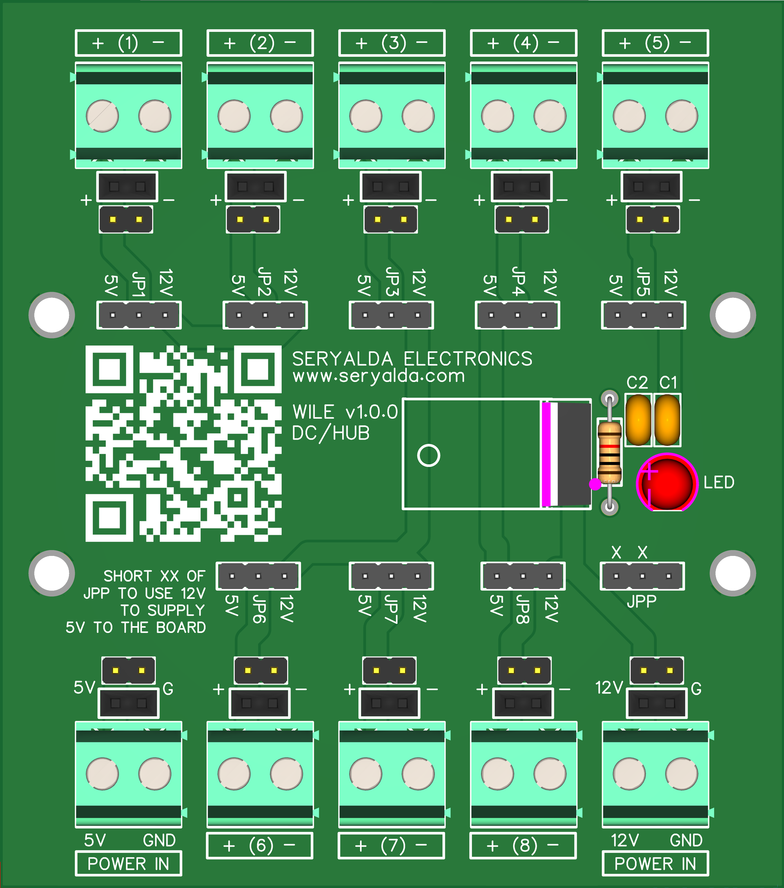

## Top
# DAWG Board Version History

### 🏡 [Home](https://github.com/seryalda)

## Overview

DAWG (AC Relay Driver Board). This board is purpose-built to address a common need in electronics projects: providing a reliable AC relay driver. Its primary goal is to enable low-voltage output controllers like Arduino and ESP microcontrollers to efficiently control multiple AC CONTACTORS or Industrial DC Relay Switches (of DC voltage more than 12VDC).

📚 Check out the different board versions below:

## Version
<!--
- [🚀 Version 1.0.0](./1.0.0) : This is the initial board version that started it all!
-->

| Version | Board Image | Release Date  | Remarks   | Notes |
|--------------------|--------------------------------------------|-------------------------------------------------------------------------------------------------------|--------------------------------------------------------------------------------------------------------------------------------------------------|---------------|
| [1.0.0](./1.0.0) |  | NOV 2023 | NA | Alright! |

[🔝 Top](#top)

## Changelog
- [📃 Logs and Releases](./changelog.md)

[🔝 Top](#top)
